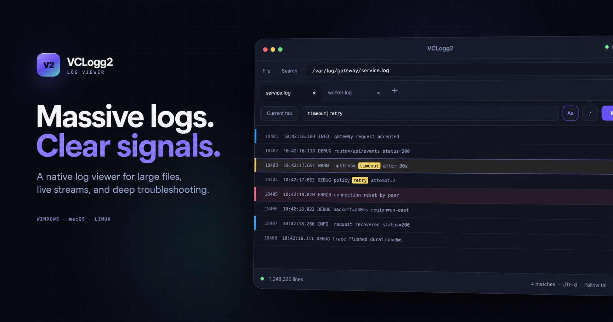

# VCLogg2

VCLogg2 (VCLogg) is a free, open-source desktop log viewer for large files on Windows, macOS and Linux, built with Rust and GPUI.

Open log files produced by your application's logger, search across files with keywords or regex, follow live updates and export matching lines.

[Website](https://zhaiyanqi.github.io/vclogg2/) · [Download](https://github.com/zhaiyanqi/vclogg2/releases/latest) · [Wiki](https://github.com/zhaiyanqi/vclogg2/wiki) · [简体中文](README.zh-CN.md)

## Features

- **Large files** — Background indexing, on-demand decoding, and virtualized scrolling.
- **Flexible search** — Keywords, regex, and quick find across the current file, open tabs, or a directory.
- **Live logs** — Refresh growing logs and follow the latest lines.
- **Log analysis** — Bookmarks, color labels, grouped results, and streaming export.
- **Native workspace** — Multiple tabs and windows, automatic encoding detection, and session recovery.

## Download

Get the [latest release](https://github.com/zhaiyanqi/vclogg2/releases/latest) for your platform:

| Platform | Package | Install |
| --- | --- | --- |
| Windows 10/11 · x64 | Portable ZIP / Setup EXE | Extract and run `vclogg2.exe`, or run the installer |
| macOS 15 · Apple Silicon | DMG | Drag `VCLogg2.app` into Applications |
| Linux · x86_64 (Ubuntu 22.04) | tar.gz | Extract and run `./Install-VCLogg2-linux.sh --launch` |

See [installation](https://github.com/zhaiyanqi/vclogg2/wiki/Installation) for data locations and [build and release notes](https://github.com/zhaiyanqi/vclogg2/wiki/Build-and-Release) for signing details. Current macOS packages use ad-hoc signing without notarization.

## Build from source

See the [source build guide](https://github.com/zhaiyanqi/vclogg2/wiki/Building) for Rust and platform prerequisites, environment setup, Debug/Release commands, and validation. Build and packaging scripts are maintained in `scripts/` and use the committed `Cargo.lock`.

The optional cloud filter server lives in [`server/`](server/README.md). Its Windows/Linux packages are included in tagged releases; local packaging uses `scripts/package-server-release.sh` or `scripts/package-server-release.ps1`.

## Documentation & contributing

Detailed documentation is maintained in the [GitHub Wiki](https://github.com/zhaiyanqi/vclogg2/wiki), primarily in Chinese.

- [Quick start](https://github.com/zhaiyanqi/vclogg2/wiki/Getting-Started) · [Interface](https://github.com/zhaiyanqi/vclogg2/wiki/Interface) · [Keyboard shortcuts](https://github.com/zhaiyanqi/vclogg2/wiki/Keyboard-Shortcuts)
- [Search & filters](https://github.com/zhaiyanqi/vclogg2/wiki/Search-and-Filters) · [Live logs](https://github.com/zhaiyanqi/vclogg2/wiki/Live-Logs) · [Settings](https://github.com/zhaiyanqi/vclogg2/wiki/Settings)
- [Project overview](https://github.com/zhaiyanqi/vclogg2/wiki/Project-Overview) · [Technology stack](https://github.com/zhaiyanqi/vclogg2/wiki/Technology-Stack) · [Architecture](https://github.com/zhaiyanqi/vclogg2/wiki/Architecture)
- [Contributing](https://github.com/zhaiyanqi/vclogg2/wiki/Contributing) · [Troubleshooting](https://github.com/zhaiyanqi/vclogg2/wiki/Troubleshooting) · [All documents](https://github.com/zhaiyanqi/vclogg2/wiki)

Issues and pull requests are welcome.

## Acknowledgments

Thanks to [klogg](https://github.com/variar/klogg) for inspiring work on high-performance log browsing and search, and to the Rust, [GPUI](https://github.com/zed-industries/zed), and [GPUI Component](https://github.com/longbridge/gpui-component) communities.

## License

[Apache License 2.0](LICENSE).
