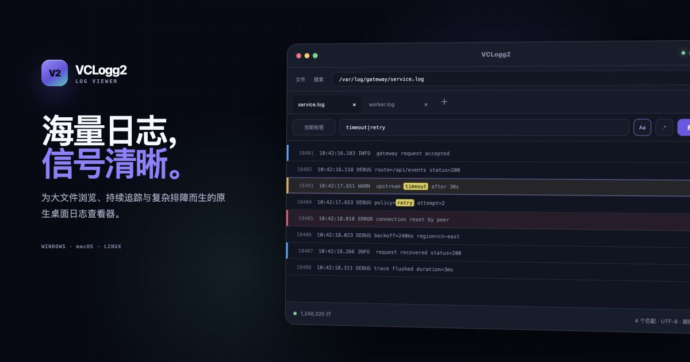

# VCLogg2

使用 Rust 与 GPUI 构建的高性能原生桌面日志查看器，专为大文件设计。

[项目主页](https://zhaiyanqi.github.io/vclogg2/) · [下载](https://github.com/zhaiyanqi/vclogg2/releases/latest) · [Wiki 文档](https://github.com/zhaiyanqi/vclogg2/wiki) · [English](README.md)

## 特性

- **大文件浏览** — 后台索引、按需解码和虚拟化滚动。
- **灵活检索** — 多关键词、正则与页内查找，支持当前文件、已打开标签和目录范围。
- **实时日志** — 自动刷新持续增长的日志，支持末尾跟随。
- **日志分析** — 行标记、颜色标签、结果分组与流式导出。
- **原生工作区** — 多标签、多窗口、自动编码检测与会话恢复。

## 下载

从[最新版本](https://github.com/zhaiyanqi/vclogg2/releases/latest)下载对应平台的安装包：

| 平台 | 格式 | 安装方式 |
| --- | --- | --- |
| Windows 10/11 · x64 | 便携 ZIP / 安装 EXE | 解压后运行 `vclogg2.exe`，或运行安装向导 |
| macOS 15 · Apple Silicon | DMG | 将 `VCLogg2.app` 拖入 Applications |
| Linux · x86_64（Ubuntu 22.04） | tar.gz | 解压后运行 `./Install-VCLogg2-linux.sh --launch` |

数据目录见[安装与升级](https://github.com/zhaiyanqi/vclogg2/wiki/Installation)，签名说明见[构建与发布](https://github.com/zhaiyanqi/vclogg2/wiki/Build-and-Release)。当前 macOS 包使用临时签名，尚未公证。

## 从源码构建

[源码构建指南](https://github.com/zhaiyanqi/vclogg2/wiki/Building)提供 Rust 与平台依赖、完整环境配置、Debug/Release 命令和验证说明。构建与打包脚本统一保留在 `scripts/`，使用仓库中的 `Cargo.lock`。

## 文档与贡献

详细文档统一维护在 [GitHub Wiki](https://github.com/zhaiyanqi/vclogg2/wiki)。

- [快速上手](https://github.com/zhaiyanqi/vclogg2/wiki/Getting-Started) · [界面导览](https://github.com/zhaiyanqi/vclogg2/wiki/Interface) · [键盘快捷键](https://github.com/zhaiyanqi/vclogg2/wiki/Keyboard-Shortcuts)
- [搜索与过滤](https://github.com/zhaiyanqi/vclogg2/wiki/Search-and-Filters) · [动态日志](https://github.com/zhaiyanqi/vclogg2/wiki/Live-Logs) · [设置](https://github.com/zhaiyanqi/vclogg2/wiki/Settings)
- [项目概况](https://github.com/zhaiyanqi/vclogg2/wiki/Project-Overview) · [技术栈](https://github.com/zhaiyanqi/vclogg2/wiki/Technology-Stack) · [架构](https://github.com/zhaiyanqi/vclogg2/wiki/Architecture)
- [贡献指南](https://github.com/zhaiyanqi/vclogg2/wiki/Contributing) · [常见问题](https://github.com/zhaiyanqi/vclogg2/wiki/Troubleshooting) · [全部文档](https://github.com/zhaiyanqi/vclogg2/wiki)

欢迎提交 Issue 和 Pull Request。

## 致谢

参见[英文 README](README.md#acknowledgments)。

## 许可证

[Apache License 2.0](LICENSE)。
